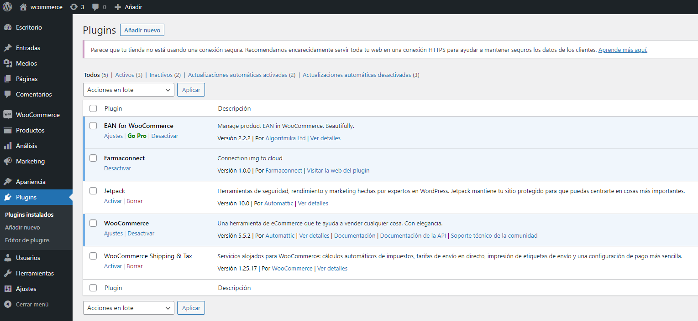

# Farmaconnect
## Plungin de Woocommerce
Sincronización de imagenes con woocommerce

# Requisitos
Tener instalador el plugin de EAN for WooCommerce en el proyecto.
Versión 4.0 o superior de Worpress
####
# Cómo usar este plugin
Lo primero es descomprimir el archivo en la carpeta de plugin de wordpress (./wp-content/plugins).
####
### Activación
Después hay que activar el plugin para poderlo configurar.
####

### Dónde configurar
Una vez activado, ha que dirigirse del menu de woocommerce a /Ajustes/Farmaconnect
####
####

### Datos de configuración
Desde Farmaconnect, se proveerá los datos para cumplimentar el formulario, que consiste con el numero de cliente y código de validación.
####

####
Una vez realizado este proceso se mostrará las imagenes en los siguiente apartados:

- woocommerce_before_shop_loop_item_title
- woocommerce_before_single_product_summary
- woocommerce_blocks_product_grid_item_html
- woocommerce_cart_item_thumbnail
- woocommerce_before_mini_cart
- woocommerce_product_get_image
